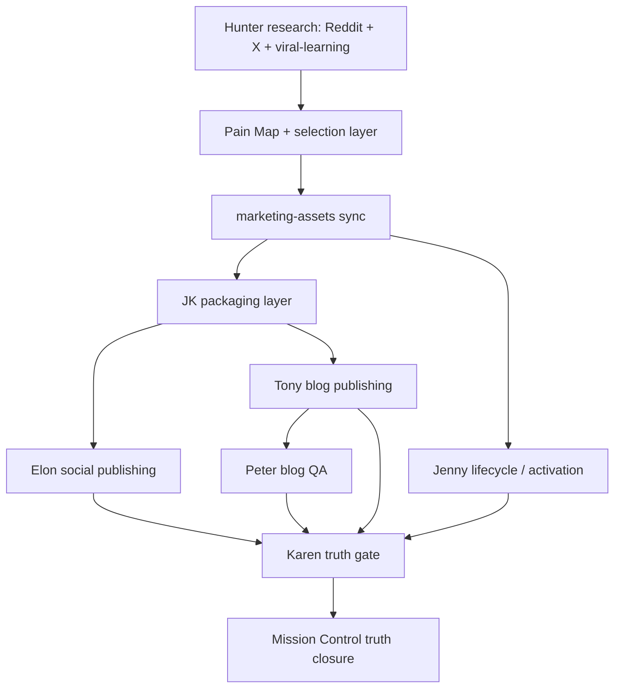

# OpenClaw Marketing OS

> **A multi-agent marketing operating system for AI products.**
> Turn community research into assets, threads, blogs, lifecycle campaigns, QA, and truth-state closure.

OpenClaw Marketing OS is an open-source skill for running a **founder-led AI marketing machine** with agent-style roles, durable assets, delivery receipts, QA gates, and Mission Control truth.

Instead of treating marketing as disconnected prompts, this system treats it as a coordinated operating loop:

**research → asset sync → social → blog → lifecycle → QA → truth closure**

---

## Why this exists

Most “AI marketing” workflows break in the same place:
- research never becomes reusable assets
- content gets drafted but not published
- posts go live without proof
- teams confuse activity with delivery
- no one knows what is actually complete

OpenClaw Marketing OS solves that by turning marketing into a **multi-lane system with receipts**.

It is built for teams that want:
- daily research discipline
- reusable marketing-assets
- X / LinkedIn / Facebook publishing
- keyword-first blog production
- lifecycle / activation execution
- QA and blocker handling
- same-day truth in Mission Control

---

## What it includes

### Hunter — community intelligence
- Reddit + X research
- Pain Map
- selection layer
- Intel Pack
- X viral-learning loop
- marketing-assets sync

### JK — packaging layer
- converts same-day research + assets into cleaner writing substrate

### Elon — social publishing
- publishes X threads, LinkedIn posts, and Facebook posts
- requires URL + visibility proof + ASSET_CHECK

### Tony — blog publishing
- keyword-first blog production
- publish-first, not draft-first
- source publish + QA closure

### Jenny — lifecycle / activation
- cohort selection
- send execution
- delivery truth
- writeback/accounting

### Peter — QA closeout
- verifies live/public blog reality
- closes blog lane with PASS / FAIL / BLOCKED truth

### Karen — truth gate
- verifies that claimed completion matches real evidence

### Mission Control — state mirror
- reflects same-day delivery truth
- prevents optimism inflation
- records blockers and make-up work

---

## Demo workflow

### Example same-day run

1. **Hunter** finds the dominant pain point on Reddit + X
2. Hunter syncs the durable learnings into `marketing-assets`
3. **JK** packages the same-day substrate
4. **Elon** publishes a deep X thread + LinkedIn/Facebook variants
5. **Tony** publishes a keyword-first blog post
6. **Jenny** sends a lifecycle / activation batch
7. **Peter** verifies live blog state
8. **Karen** checks whether completion claims are actually true
9. **Mission Control** records the final same-day truth

---

## What makes this different from normal marketing skills

Most skills help you create:
- one post
- one article
- one campaign idea

This one helps you run the **operating system behind the work**.

That means it emphasizes:
- handoff discipline
- asset-layer reuse
- publish proof
- QA gates
- blocker handling
- same-day receipts
- truth-state language

In other words:

**It is not just content generation. It is marketing operations.**

---

## Built for

OpenClaw Marketing OS is especially useful for:
- AI products
- founder-led SaaS teams
- open-source growth teams
- multi-agent marketing experiments
- teams that need research → publish → QA loops

---

## Core operating principles

- research is not completion
- drafts are not completion
- published without proof is not completion
- every lane leaves a receipt
- missing ASSET_CHECK means incomplete truth
- Mission Control must match reality
- partial work must not be inflated into false success

---

## Skill structure

Main skill entry:
- `openclaw-marketing-os/SKILL.md`

References:
- `references/system-map.md`
- `references/role-contracts.md`
- `references/daily-loop.md`
- `references/demo-workflow.md`
- `references/open-source-packaging.md`

---

## Good fit use cases

Use this skill when you want to:
- build a daily AI marketing machine
- coordinate research, assets, social, blog, lifecycle, and QA
- audit where your content pipeline is lying to you
- make marketing work visible, accountable, and repeatable
- package an OpenClaw/ClawLite-style marketing system for public reuse

---

## Public release

- **Name:** OpenClaw Marketing OS
- **Version:** 0.1.1
- **GitHub:** https://github.com/X-RayLuan/openclaw-marketing-os

